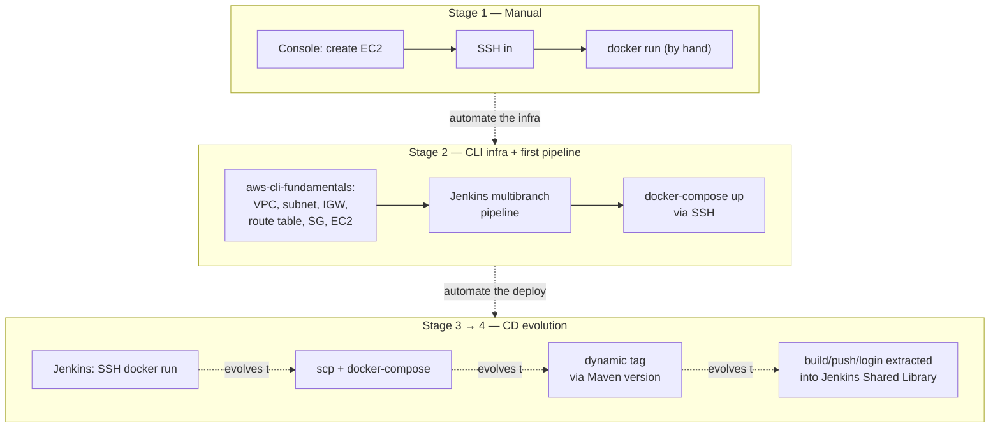

# AWS EC2 CI/CD Pipeline — From Manual Deploy to a Shared-Library Jenkins Pipeline

> **FR** — Une même application Java déployée sur EC2 quatre fois, avec un niveau d'automatisation croissant à chaque itération : déploiement manuel, provisioning d'infrastructure scripté en CLI, pipeline Jenkins via SSH, puis évolution vers Docker Compose, versioning dynamique et extraction de la logique de build/push dans une Jenkins Shared Library.
>
> **EN** — The same Java application deployed to EC2 four times, with increasing automation at each iteration: manual deployment, CLI-scripted infrastructure, a Jenkins SSH pipeline, then an evolution to Docker Compose, dynamic versioning, and extracting the build/push logic into a Jenkins Shared Library.


---

## Problem

Automation is a series of deliberate decisions, not a single leap. Going straight from "click through the console" to "full CI/CD with a shared pipeline library" skips the reasoning that makes each step necessary: why script the infrastructure before automating the deploy, why a shell script instead of inline SSH commands, why a dynamic image tag instead of a hardcoded one, why extract logic into a shared library instead of copy-pasting it across Jenkinsfiles. This project keeps every one of those intermediate stages instead of only showing the final state.

## Solution

The same Spring Boot application is deployed to EC2 through four stages, each removing one manual step from the last:

1. **Manual** — console-provisioned EC2, SSH in, `docker run` by hand.
2. **CLI-driven infrastructure** — the same VPC/subnet/IGW/route table/security group/EC2/key pair recreated entirely via the AWS CLI instead of console clicks, plus a first Jenkins multibranch pipeline. The command-by-command walkthrough for this stage lives in a dedicated repo, [aws-cli-fundamentals](https://github.com/m-bengueddache/aws-cli-fundamentals) — this project picks up from there rather than duplicating it.
3. **Automated CD via SSH** — Jenkins builds and pushes the image, then SSHes into EC2 to run it directly.
4. **Compose + dynamic versioning + shared library** — deployment moves to Docker Compose (multi-service: app + Postgres), the image tag is derived from the Maven version instead of hardcoded, and the build/push/login logic is extracted into a reusable [Jenkins Shared Library](https://github.com/m-bengueddache/jenkins-groovy-shared-library) instead of living inline in the Jenkinsfile.

This repo picks up the story once the infrastructure exists — its own `Jenkinsfile`/`Dockerfile`/`docker-compose.yaml` implement stages 3-4 (the CD pipeline itself), not stage 2's provisioning.

## Architecture



## Skills demonstrated

- Recognizing which parts of a deployment to automate first — infrastructure before pipeline, pipeline before shared-library extraction — rather than automating everything at once
- Building a Jenkins CD pipeline against a specific EC2 target via `sshagent`, `scp`, and remote shell execution, understanding exactly what each step buys over the previous one
- Extracting inline shell logic into a standalone, testable script (`server-cmds.sh`) once the inline version becomes hard to read
- Deriving a Docker image tag from the Maven project version (`build-helper:parse-version` + regex extraction) instead of hardcoding it, and guarding against the resulting CI self-trigger loop with an ignore-committer branch strategy
- Extracting repeated pipeline logic (`buildJar`, `buildImage`, `dockerLogin`, `dockerPush`) into a versioned [Jenkins Shared Library](https://github.com/m-bengueddache/jenkins-groovy-shared-library) instead of duplicating it across every Jenkinsfile

## Key technical decisions

| Decision | Why |
|---|---|
| Four kept stages instead of one final pipeline | The reasoning behind each automation step is the point — collapsing them into one Jenkinsfile would hide *why* each change was made. |
| Docker Compose over a single `docker run`, from stage 3 onward | The app needs a database sidecar (Postgres); Compose expresses that as one file instead of two coordinated `docker run` commands. |
| Dynamic image tag from the Maven version, not `latest` | `latest` gives no traceability between a running container and the code that produced it; a version + build number does. |
| Build/push/login logic extracted into a Jenkins Shared Library | `buildJar()`, `buildImage()`, `dockerLogin()`, `dockerPush()` would otherwise be duplicated in every Jenkinsfile across every branch and every project; the shared library is imported once and versioned independently. |
| `jenkins@example.com` as the CI commit author | Lets an "ignore committer" branch strategy detect and skip builds triggered by the pipeline's own version-bump commit, avoiding an infinite build loop. |

## Limitations

- Single EC2 instance, no load balancer — a deploy briefly interrupts the running container.
- No automated rollback if the new image fails to start.
- Credentials referenced as Jenkins credentials in this repo's `Jenkinsfile` and in the shared library (`dockerhub-credentials`, `ec2-server-key`, `git-credentials`) — set these up in Jenkins before running the pipeline; no real infrastructure values are committed here.
- AWS CLI infrastructure provisioning for this project follows the same command sequence documented in [aws-cli-fundamentals](https://github.com/m-bengueddache/aws-cli-fundamentals) rather than duplicating it here — that sequence is run manually, not wrapped in a script.
- Registry is Docker Hub, not Amazon ECR — an ECR push (authenticate, tag, push) was validated manually as a separate exercise but is not wired into this pipeline. See Roadmap.

## Roadmap

- [ ] Wire the manually-validated ECR flow (`aws ecr get-login-password` → `docker tag` → `docker push`) into the pipeline as an alternate or additional registry target
- [ ] Add `kubectl`-style rollout verification (health check) after `docker-compose up` before considering the deploy successful
- [ ] Replace the single EC2 target with an Auto Scaling Group behind a load balancer for zero-downtime deploys
- [ ] Provision the EC2 target itself with Terraform instead of the AWS CLI scripts, once the Terraform module is further along

---

## Jenkins Prerequisites

| Credential ID | Type | Usage |
|---|---|---|
| `dockerhub-credentials` | Username/Password | Docker login to Docker Hub, used by the shared library's `dockerLogin()` |
| `ec2-server-key` | SSH Username with Private Key | SSH/SCP access to the EC2 instance |
| `git-credentials` | Username/Password | Fetch the Jenkins Shared Library and push the version-bump commit back to GitHub |

Maven must be configured in Jenkins: **Manage Jenkins → Tools → Maven installations**, name `maven`.

## Project Structure

```
.
├── Jenkinsfile          # version bump -> build jar -> build+push image (Docker Hub, via shared library) -> Compose deploy -> commit version
├── Dockerfile           # Wildcard *.jar copy, Amazon Corretto 17
├── docker-compose.yaml  # App + Postgres, image parameterized via env var
├── server-cmds.sh       # Deploy script executed on the EC2 instance
├── pom.xml              # Maven project (Spring Boot 3)
└── src/                 # Java application source
```
